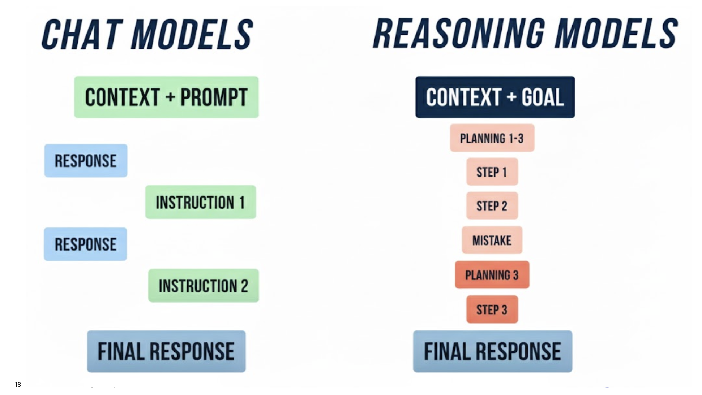
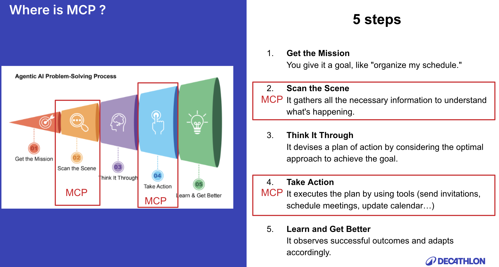
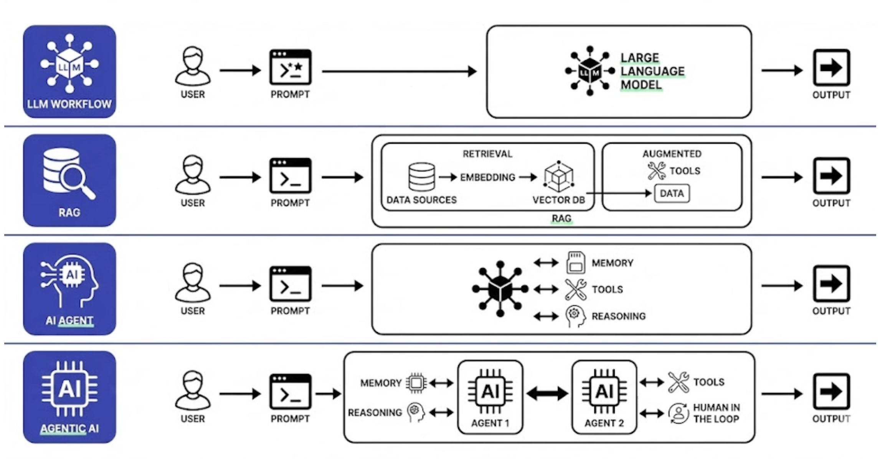

# **Why MCP labs at Decathlon and Adeo ?**

# **What is an AI agent?**

---

# **What is AI?**

## Emulate the intellectual capabilities of a human being

From Gemini: “Emulate means to imitate or reproduce the functions, behavior, or characteristics of something, often with the goal of obtaining a similar or identical result. The term is often used in computer science.”

---

# **What is Generative AI?**

## Discipline of AI for creating content (text, image sound, video)

---

# **What are "LLMs"**

## Computer systems trained on an _enormous amount_ of data

They can:
1. Understand requests written in natural language
2. Generate text satisfying the requests made to them

---

# **⚠ Users give LLMs an `intent`**

## We do not _precisely_ indicate how our request should be processed.

---

# **Example - Question to an LLM**

## What is entropy?

At its core, entropy is a measure of disorder, randomness, or the lack of predictability in a system.  
It is a fundamental concept that started in physics (thermodynamics) but has since spread to chemistry, information technology, and even how we look at our daily lives.  

Here is a breakdown of what entropy means depending on the context.
1. The Classical View: Thermodynamics (Heat and Energy)In physics, entropy ($S$) was first defined to understand why heat moves from hot things to cold things, and why we can never build a perfectly efficient engine.  
(...)

---

# **Example - Question to an LLM**

## Explain what is entropy in one sentence, with funny emojis, to a 5 years old child

Entropy is the universe's way of saying "I don't want to clean my room!" so everything naturally goes from neat and tidy 🧱 to super messy and scattered 🌀!

---

# **The less precise the request is, the more the LLM will try to guess what you truly want (your "`intent`”)...**

## …and potentially "mis-answer” (the answer is not what you wanted).

---

# **And what about an AI Agent?**

## LLM
Understand `intents` and generate content

## We add complex **reasoning** capabilities
Defining a plan and a strategy to satisfy the demand.

## We also add a **memory** system

## We give them **tools**

---

# The LLM is no longer limited to the knowledge it received during its training.

## It can call on external servers to conduct research and execute processes.

# It can **Act**.

---

---

# **Reasoning? How can an LLM "reason" ?**

## The model is encouraged to "**think aloud**" and break down the problem into steps.

## The model is **trained to connect words and concepts** with one another.

## **Beyond a certain size** (number of parameters), abilities seem to emerge, capturing subtle relationships within the training data.

---

---

# **What about "Tools"?**

## Several LLMs, from different providers (OpenAI ChatGPT, Google Gemini, Anthropic Claude...)

Idea of extensions to provide more capabilities:
- Search on the Web
- Access data in a specific database
- Create or update data

AI giants agreed on a standard to write these capabilities (or tools).

## => **Model Context Protocol (MCP)**

---

---

# **Why is it important for us?**

---

---

In just 2 years, we went from:
- a tool that provides an answer from a static training limited to the date at which the model was trained (“cutoff”)
- to a tool that can give better answer by using documents and data at its disposal (RAG)
- then to a tool able to solve a problem by devising a strategy and using tools in an autonomous way; it not only provide just an answer, it can act

Next step: an ecosystem of agents, able to communicate with each others, each agent being specialized at doing something.  
For instance: an agent capable of finding the best item corresponding to your needs, an agent able to manage a cart for you, another able to checkout for you, and the last one being able to track your orders and even find solutions if there is an issue with your order.

---

## **This is a potential new way of building softwares and providing digital services**

**From** a human user using a User Interface, clicking and navigating  
**To** an intent expressed in natural language for an agent, that uses tools in an autonomous way, or collaborates with other agents to complete a use case. 

  

Instead of coding the algorithms describing precisely the sequence of actions for a specific use case, an agent choose the tools with its intelligence and the description of the expected result.  

“When an item in my department runs out of stock, place a replenishment order calculated using recent sales trends and historical data from previous years.”
